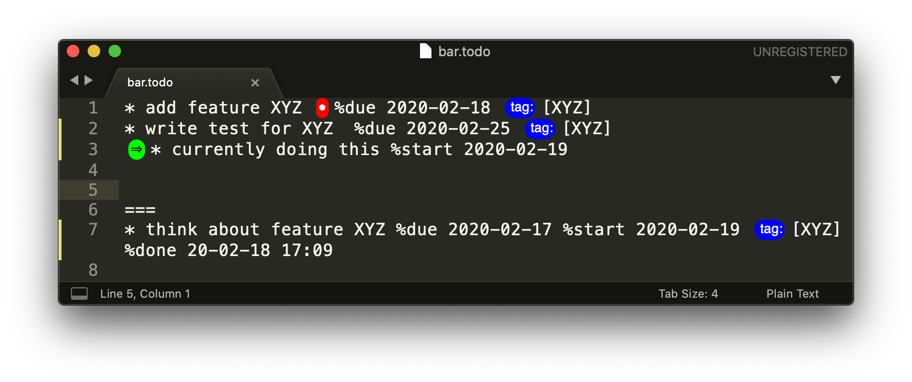

# sublime-done

### Done - a simple Todo list.

### Prerequisites
* Works only on *.todo files. 
* You need a **separator** between done and open tasks, default is **===**

### Supported Commands
Action | Shortcut
------------ | -------------
Done: Add new todo | ctrl+alt+a
Done: Mark as done | ctrl+alt+d
Done: Add new tag | ctrl+alt+n
Done: Add existing tag | ctrl+alt+t
Done: Set due date | ctrl+alt+u
Done: Show due today | ctrl+alt+s

Commands are also accessible via menu or command palette
